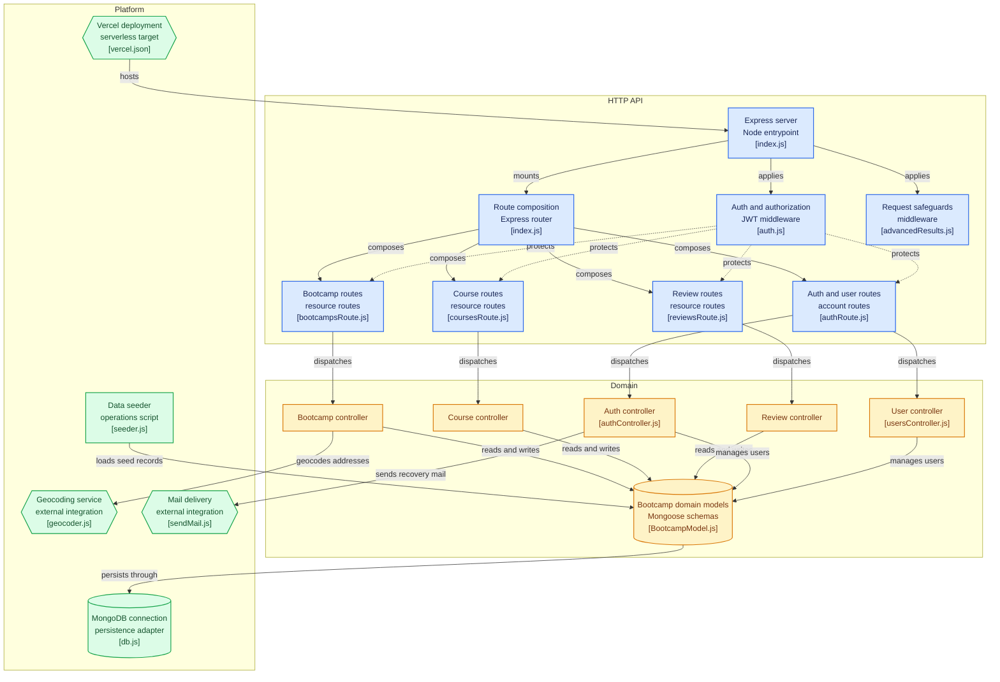

# NodeJs API

Backend API for the DevCamper application to manage bootcamps, courses, reviews, and users.

## Documentation

The documentation has been split into several files for better organization:

- **[System Design](docs/SYSTEM_DESIGN.md)**: Comprehensive system architecture, design patterns, and technical overview of the project.
- **[Setup and Configuration](docs/SETUP_AND_CONFIGURATION.md)**: Instructions on how to install, configure, and run the project.
- **[API Reference](docs/API_REFERENCE.md)**: Detailed documentation of all API endpoints, including request/response examples.
- **[Project Structure](docs/PROJECT_STRUCTURE.md)**: Explanation of the codebase organization and key directories.
- **[Project Flow](docs/PROJECT_FLOW.md)**: Request lifecycle and data flow diagrams.

## Project Flow Diagram

```mermaid
flowchart TD

subgraph group_client["Client"]
end

subgraph group_api["HTTP API"]
  node_index_js["index.js<br/>app entry<br/>[index.js]"]
  node_routes_index["Routes<br/>router compose<br/>[index.js]"]
  node_middleware_index["Middleware<br/>[index.js]"]
  node_auth_mw["Auth<br/>[auth.js]"]
  node_validate_mw["Validate<br/>validation middleware<br/>[validate.js]"]
  node_async_mw["Async<br/>error wrapper<br/>[async.js]"]
  node_error_mw["Error Handler<br/>error middleware<br/>[error.js]"]
  node_request_logger["Request Log<br/>logging middleware<br/>[requestLogger.js]"]
end

subgraph group_domain["Domain"]
  node_auth_ctrl["Auth Ctrl<br/>auth controller<br/>[authController.js]"]
  node_users_ctrl["Users Ctrl<br/>user controller<br/>[usersController.js]"]
  node_bootcamps_ctrl["Bootcamps Ctrl<br/>bootcamp controller"]
  node_courses_ctrl["Courses Ctrl<br/>course controller"]
  node_reviews_ctrl["Reviews Ctrl<br/>review controller"]
  node_validators["Validators<br/>validation rules<br/>[index.js]"]
end

subgraph group_data["Data"]
  node_models_index["Models<br/>model exports<br/>[index.js]"]
  node_db_index[("DB<br/>database wiring<br/>[index.js]")]
  node_bootcamp_model["Bootcamp<br/>mongoose model<br/>[BootcampModel.js]"]
  node_course_model["Course<br/>mongoose model<br/>[CourseModel.js]"]
  node_review_model["Review<br/>mongoose model<br/>[ReviewModel.js]"]
  node_user_model["User<br/>mongoose model<br/>[UserModel.js]"]
end

subgraph group_integrations["Integrations"]
  node_geocoder["Geocoder<br/>external service<br/>[geocoder.js]"]
  node_send_mail["Send Mail<br/>email service<br/>[sendMail.js]"]
  node_csrf_utils["CSRF Utils<br/>security utility<br/>[reproduce_csrf.js]"]
end

subgraph group_ops["Ops"]
  node_seeder["Seeder<br/>data seeding<br/>[seeder.js]"]
  node_tests["API Tests<br/>integration tests<br/>[auth.test.js]"]
end

node_index_js -->|"mounts"| node_routes_index
node_index_js -->|"uses"| node_middleware_index
node_index_js -->|"connects"| node_db_index
node_index_js -->|"finalizes"| node_error_mw
node_routes_index -->|"routes"| node_auth_ctrl
node_routes_index -->|"routes"| node_users_ctrl
node_routes_index -->|"routes"| node_bootcamps_ctrl
node_routes_index -->|"routes"| node_courses_ctrl
node_routes_index -->|"routes"| node_reviews_ctrl
node_routes_index -->|"guards"| node_auth_mw
node_routes_index -->|"validates"| node_validate_mw
node_middleware_index -->|"exports"| node_async_mw
node_middleware_index -->|"exports"| node_auth_mw
node_middleware_index -->|"exports"| node_validate_mw
node_middleware_index -->|"exports"| node_request_logger
node_middleware_index -->|"exports"| node_error_mw
node_auth_ctrl -->|"uses"| node_user_model
node_users_ctrl -->|"uses"| node_user_model
node_bootcamps_ctrl -->|"uses"| node_bootcamp_model
node_bootcamps_ctrl -->|"calls"| node_geocoder
node_courses_ctrl -->|"uses"| node_course_model
node_reviews_ctrl -->|"uses"| node_review_model
node_auth_ctrl -->|"calls"| node_send_mail
node_bootcamps_ctrl -->|"checks"| node_validators
node_courses_ctrl -->|"checks"| node_validators
node_reviews_ctrl -->|"checks"| node_validators
node_users_ctrl -->|"checks"| node_validators
node_auth_ctrl -->|"checks"| node_validators
node_models_index -->|"exports"| node_bootcamp_model
node_models_index -->|"exports"| node_course_model
node_models_index -->|"exports"| node_review_model
node_models_index -->|"exports"| node_user_model
node_db_index -->|"supports"| node_models_index
node_seeder -->|"uses"| node_db_index
node_seeder -->|"loads"| node_models_index
node_tests -->|"exercises"| node_routes_index
node_tests -->|"regresses"| node_middleware_index
node_csrf_utils -->|"supports"| node_middleware_index
node_request_logger -->|"observes"| node_index_js

click node_index_js "https://github.com/sourav-roy/apinodejs/blob/SOURAV/index.js"
click node_routes_index "https://github.com/sourav-roy/apinodejs/blob/SOURAV/routes/index.js"
click node_middleware_index "https://github.com/sourav-roy/apinodejs/blob/SOURAV/middleware/index.js"
click node_auth_mw "https://github.com/sourav-roy/apinodejs/blob/SOURAV/middleware/auth.js"
click node_validate_mw "https://github.com/sourav-roy/apinodejs/blob/SOURAV/middleware/validate.js"
click node_async_mw "https://github.com/sourav-roy/apinodejs/blob/SOURAV/middleware/async.js"
click node_error_mw "https://github.com/sourav-roy/apinodejs/blob/SOURAV/middleware/error.js"
click node_request_logger "https://github.com/sourav-roy/apinodejs/blob/SOURAV/middleware/requestLogger.js"
click node_auth_ctrl "https://github.com/sourav-roy/apinodejs/blob/SOURAV/controllers/authController.js"
click node_users_ctrl "https://github.com/sourav-roy/apinodejs/blob/SOURAV/controllers/usersController.js"
click node_bootcamps_ctrl "https://github.com/sourav-roy/apinodejs/blob/SOURAV/controllers/bootcampsController.js"
click node_courses_ctrl "https://github.com/sourav-roy/apinodejs/blob/SOURAV/controllers/coursesController.js"
click node_reviews_ctrl "https://github.com/sourav-roy/apinodejs/blob/SOURAV/controllers/reviewsController.js"
click node_validators "https://github.com/sourav-roy/apinodejs/blob/SOURAV/utils/validators/index.js"
click node_models_index "https://github.com/sourav-roy/apinodejs/blob/SOURAV/models/index.js"
click node_db_index "https://github.com/sourav-roy/apinodejs/blob/SOURAV/db/index.js"
click node_bootcamp_model "https://github.com/sourav-roy/apinodejs/blob/SOURAV/models/BootcampModel.js"
click node_course_model "https://github.com/sourav-roy/apinodejs/blob/SOURAV/models/CourseModel.js"
click node_review_model "https://github.com/sourav-roy/apinodejs/blob/SOURAV/models/ReviewModel.js"
click node_user_model "https://github.com/sourav-roy/apinodejs/blob/SOURAV/models/UserModel.js"
click node_geocoder "https://github.com/sourav-roy/apinodejs/blob/SOURAV/utils/geocoder.js"
click node_send_mail "https://github.com/sourav-roy/apinodejs/blob/SOURAV/utils/sendMail.js"
click node_csrf_utils "https://github.com/sourav-roy/apinodejs/blob/SOURAV/utils/csrf/reproduce_csrf.js"
click node_seeder "https://github.com/sourav-roy/apinodejs/blob/SOURAV/seeder.js"
click node_tests "https://github.com/sourav-roy/apinodejs/blob/SOURAV/tests/auth.test.js"

classDef toneNeutral fill:#f8fafc,stroke:#334155,stroke-width:1.5px,color:#0f172a
classDef toneBlue fill:#dbeafe,stroke:#2563eb,stroke-width:1.5px,color:#172554
classDef toneAmber fill:#fef3c7,stroke:#d97706,stroke-width:1.5px,color:#78350f
classDef toneMint fill:#dcfce7,stroke:#16a34a,stroke-width:1.5px,color:#14532d
classDef toneRose fill:#ffe4e6,stroke:#e11d48,stroke-width:1.5px,color:#881337
classDef toneIndigo fill:#e0e7ff,stroke:#4f46e5,stroke-width:1.5px,color:#312e81
classDef toneTeal fill:#ccfbf1,stroke:#0f766e,stroke-width:1.5px,color:#134e4a
class node_index_js,node_routes_index,node_middleware_index,node_auth_mw,node_validate_mw,node_async_mw,node_error_mw,node_request_logger toneAmber
class node_auth_ctrl,node_users_ctrl,node_bootcamps_ctrl,node_courses_ctrl,node_reviews_ctrl,node_validators toneMint
class node_models_index,node_db_index,node_bootcamp_model,node_course_model,node_review_model,node_user_model toneRose
class node_geocoder,node_send_mail,node_csrf_utils toneIndigo
class node_seeder,node_tests toneTeal
```

## Quick Start

## Diagram Legend

```mermaid
flowchart TD

subgraph group_api["HTTP API"]
  node_server["Server bootstrap<br/>Express entry point<br/>[index.js]"]
  node_routes["Route aggregation<br/>router composition<br/>[index.js]"]
  node_auth_routes["Auth routes<br/>router<br/>[authRoute.js]"]
  node_bootcamp_routes["Bootcamp routes<br/>router<br/>[bootcampsRoute.js]"]
  node_controllers["Controller exports<br/>controller composition<br/>[index.js]"]
  node_authz{{"JWT &amp; role guard<br/>auth middleware<br/>[auth.js]"}}
  node_results["Query results middleware<br/>pagination/filtering<br/>[advancedResults.js]"]
  node_validation_errors["Validation &amp; error boundary<br/>middleware<br/>[validate.js]"]
end

subgraph group_domain["Domain"]
  node_bootcamps["Bootcamp controller<br/>resource controller"]
  node_courses["Course controller<br/>resource controller"]
  node_reviews["Review controller<br/>resource controller"]
  node_users["User controller<br/>user administration<br/>[usersController.js]"]
  node_auth["Auth controller<br/>identity workflow<br/>[authController.js]"]
  node_models[("Mongoose aggregates<br/>persistence models<br/>[BootcampModel.js]")]
  node_database[("MongoDB connection<br/>database adapter<br/>[db.js]")]
end

subgraph group_integrations["Integrations &amp; operations"]
  node_geocoder{{"Geocoding service<br/>external service adapter<br/>[geocoder.js]"}}
  node_email{{"Email delivery<br/>external integration<br/>[sendMail.js]"}}
  node_seeder["Data seeder<br/>development operation<br/>[seeder.js]"]
  node_fixtures["Bootcamp fixtures<br/>seed data<br/>[bootcamps.json]"]
  node_deployment["Vercel deployment<br/>deployment config<br/>[vercel.json]"]
end

node_deployment -.->|"deploys"| node_server
node_server -->|"mounts"| node_routes
node_server -->|"applies"| node_authz
node_server -->|"applies"| node_validation_errors
node_routes -->|"includes"| node_auth_routes
node_routes -->|"includes"| node_bootcamp_routes
node_routes -->|"dispatches through"| node_controllers
node_auth_routes -->|"dispatches"| node_auth
node_bootcamp_routes -->|"dispatches"| node_bootcamps
node_authz -->|"protects"| node_auth
node_authz -->|"authorizes"| node_users
node_results -->|"enriches queries"| node_bootcamps
node_controllers -->|"exports"| node_courses
node_controllers -->|"exports"| node_reviews
node_controllers -->|"exports"| node_users
node_bootcamps -->|"persists"| node_models
node_courses -->|"persists"| node_models
node_reviews -->|"persists"| node_models
node_users -->|"persists"| node_models
node_auth -->|"manages users"| node_models
node_models -->|"uses"| node_database
node_bootcamps -->|"geocodes writes"| node_geocoder
node_auth -->|"sends reset email"| node_email
node_seeder -->|"loads"| node_fixtures
node_seeder -->|"seeds"| node_database

click node_server "https://github.com/sourav-roy/apinodejs/blob/SOURAV/index.js"
click node_routes "https://github.com/sourav-roy/apinodejs/blob/SOURAV/routes/index.js"
click node_auth_routes "https://github.com/sourav-roy/apinodejs/blob/SOURAV/routes/authRoute.js"
click node_bootcamp_routes "https://github.com/sourav-roy/apinodejs/blob/SOURAV/routes/bootcampsRoute.js"
click node_controllers "https://github.com/sourav-roy/apinodejs/blob/SOURAV/controllers/index.js"
click node_authz "https://github.com/sourav-roy/apinodejs/blob/SOURAV/middleware/auth.js"
click node_results "https://github.com/sourav-roy/apinodejs/blob/SOURAV/middleware/advancedResults.js"
click node_validation_errors "https://github.com/sourav-roy/apinodejs/blob/SOURAV/middleware/validate.js"
click node_bootcamps "https://github.com/sourav-roy/apinodejs/blob/SOURAV/controllers/bootcampsController.js"
click node_courses "https://github.com/sourav-roy/apinodejs/blob/SOURAV/controllers/coursesController.js"
click node_reviews "https://github.com/sourav-roy/apinodejs/blob/SOURAV/controllers/reviewsController.js"
click node_users "https://github.com/sourav-roy/apinodejs/blob/SOURAV/controllers/usersController.js"
click node_auth "https://github.com/sourav-roy/apinodejs/blob/SOURAV/controllers/authController.js"
click node_models "https://github.com/sourav-roy/apinodejs/blob/SOURAV/models/BootcampModel.js"
click node_database "https://github.com/sourav-roy/apinodejs/blob/SOURAV/db/db.js"
click node_geocoder "https://github.com/sourav-roy/apinodejs/blob/SOURAV/utils/geocoder.js"
click node_email "https://github.com/sourav-roy/apinodejs/blob/SOURAV/utils/sendMail.js"
click node_seeder "https://github.com/sourav-roy/apinodejs/blob/SOURAV/seeder.js"
click node_fixtures "https://github.com/sourav-roy/apinodejs/blob/SOURAV/_data/bootcamps.json"
click node_deployment "https://github.com/sourav-roy/apinodejs/blob/SOURAV/vercel.json"

classDef toneNeutral fill:#f8fafc,stroke:#334155,stroke-width:1.5px,color:#0f172a
classDef toneBlue fill:#dbeafe,stroke:#2563eb,stroke-width:1.5px,color:#172554
classDef toneAmber fill:#fef3c7,stroke:#d97706,stroke-width:1.5px,color:#78350f
classDef toneMint fill:#dcfce7,stroke:#16a34a,stroke-width:1.5px,color:#14532d
classDef toneRose fill:#ffe4e6,stroke:#e11d48,stroke-width:1.5px,color:#881337
classDef toneIndigo fill:#e0e7ff,stroke:#4f46e5,stroke-width:1.5px,color:#312e81
classDef toneTeal fill:#ccfbf1,stroke:#0f766e,stroke-width:1.5px,color:#134e4a
class node_server,node_routes,node_auth_routes,node_bootcamp_routes,node_controllers,node_authz,node_results,node_validation_errors toneBlue
class node_bootcamps,node_courses,node_reviews,node_users,node_auth,node_models,node_database toneAmber
class node_geocoder,node_email,node_seeder,node_fixtures,node_deployment toneMint
```

## Key Features

- **Bootcamps**: Create, read, update, and delete bootcamps.
- **Courses**: Manage courses associated with bootcamps.
- **Reviews**: Users can review bootcamps.
- **Users & Authentication**: 
    - JWT/Cookie based authentication.
    - User roles (User, Publisher, Admin).
    - Password reset and update profile.
- **Geocoding**: Calculate location and radius for bootcamps.
- **File Upload**: Upload photos for bootcamps.
- **Security**: 
    - Password encryption.
    - Rate limiting.
    - NoSQL injection protection.
    - XSS protection.
    - HPP protection.
    - CORS enabled.

## Quick Start

1.  Clone the repo.
2.  Install dependencies: `npm install`.
3.  Set up `config/config.env` (see [Setup Guide](docs/SETUP_AND_CONFIGURATION.md)).
4.  Run dev server: `npm run dev`.

## License
ISC
