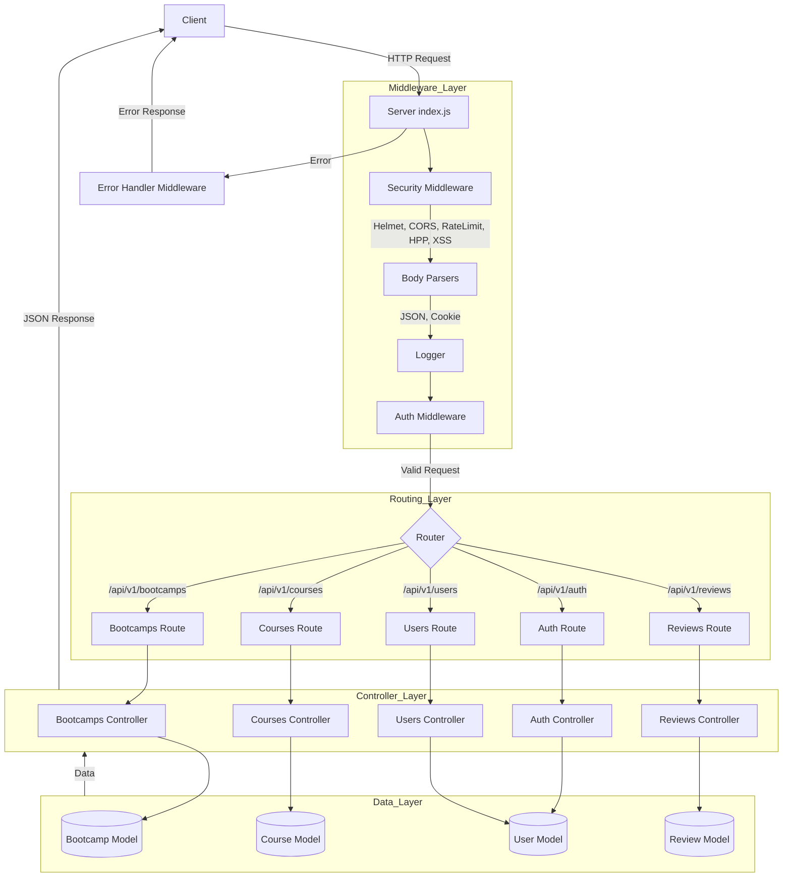
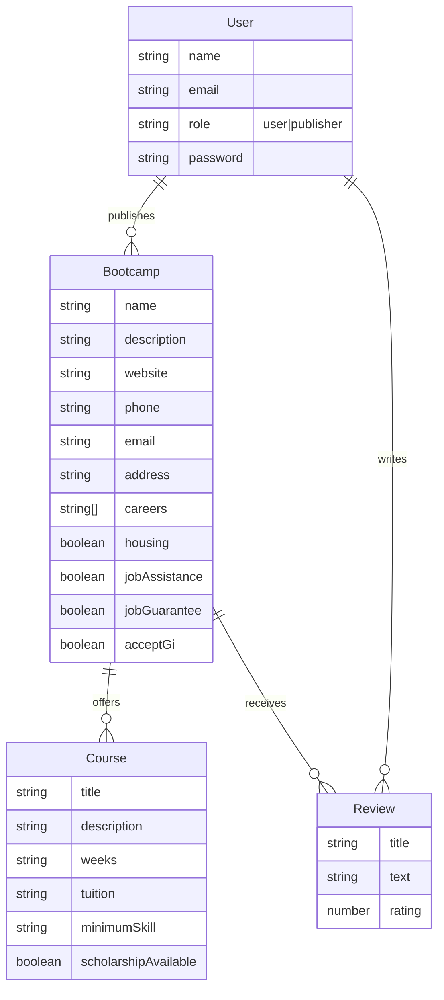

# Project Flow & Architecture

## Request Lifecycle
This diagram illustrates how a request travels through the application.

## Data Models (ERD)
Relationships between the main data entities.

## Key Components

### Middleware
- **Security**: `helmet`, `cors`, `express-rate-limit`, `hpp`, `xss-clean` protect the app.
- **Auth**: `protect` verifies JWT tokens, `authorize` checks user roles.
- **Advanced Results**: Handles pagination, filtering, and sorting for list endpoints.
- **Error Handler**: Centralized error handling for consistent responses.

### Controllers
- **Auth**: Registration, login, logout, password management.
- **Bootcamps**: CRUD operations for bootcamps, photo upload, geospatial search.
- **Courses**: CRUD operations for courses, associated with bootcamps.
- **Users**: Admin management of users.
- **Reviews**: User reviews for bootcamps.

### Models
- **User**: Stores user information, authentication, and roles.
- **Bootcamp**: Stores bootcamp details, location, and associated courses.
- **Course**: Stores course details, associated with bootcamps.
- **Review**: Stores user reviews for bootcamps.

