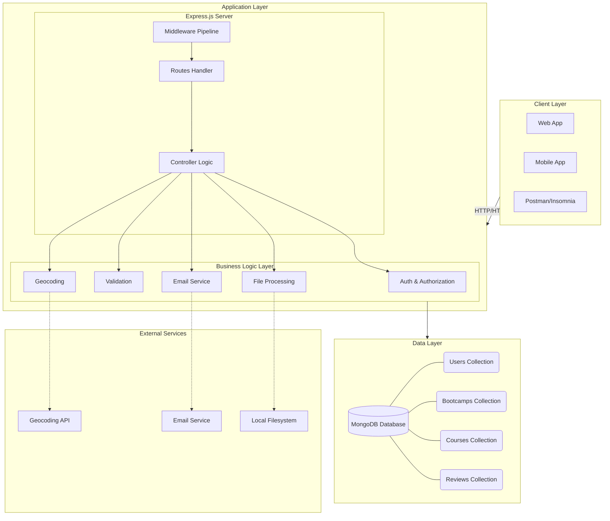
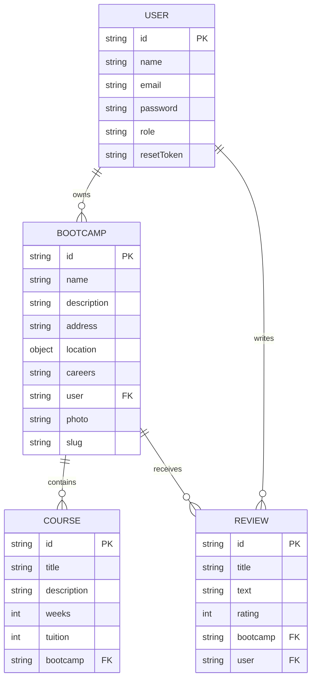
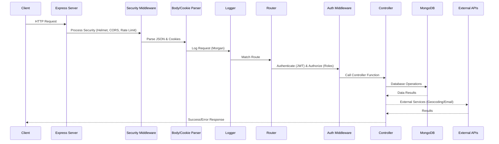
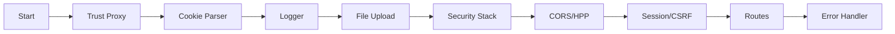
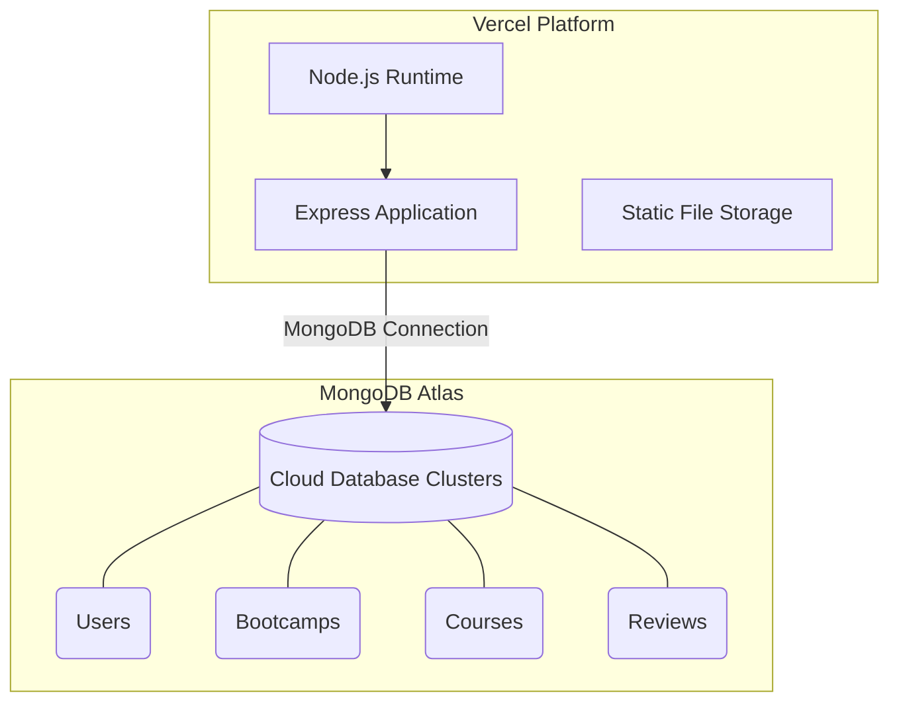

# System Design Document

## Table of Contents
1. [Project Overview](#project-overview)
2. [System Architecture](#system-architecture)
3. [Technology Stack](#technology-stack)
4. [System Components](#system-components)
5. [Data Models & Relationships](#data-models--relationships)
6. [API Design](#api-design)
7. [Security Architecture](#security-architecture)
8. [Request Flow](#request-flow)
9. [Middleware Pipeline](#middleware-pipeline)
10. [Data Management & Seeding](#data-management--seeding)
11. [Deployment Architecture](#deployment-architecture)
12. [Scalability Considerations](#scalability-considerations)
13. [Future Improvements](#future-improvements)

---

## Project Overview

**DevCamper API** is a RESTful backend API built with Node.js and Express.js for managing an educational bootcamp platform. The system allows users to:

- **Manage Bootcamps**: Create, read, update, and delete bootcamp listings
- **Manage Courses**: Associate courses with bootcamps
- **User Reviews**: Allow users to review and rate bootcamps
- **User Authentication**: JWT-based authentication with role-based access control
- **Geospatial Search**: Find bootcamps by location and radius
- **File Upload**: Upload photos for bootcamps

### Key Features
- RESTful API design
- JWT/Cookie-based authentication
- Role-based access control (User, Publisher, Admin)
- Geocoding integration for location-based searches
- Advanced querying (pagination, filtering, sorting)
- Comprehensive security measures
- File upload capabilities
- Email notifications for password reset

---

## System Architecture

### High-Level Architecture



### Architecture Pattern
- **Layered Architecture**: Separation of concerns with distinct layers (Routes → Controllers → Models)
- **MVC Pattern**: Model-View-Controller pattern (though View is replaced by JSON responses)
- **Middleware Pattern**: Request processing through middleware pipeline

---

## Technology Stack

### Core Technologies
- **Runtime**: Node.js (v20.15.0+)
- **Framework**: Express.js (v5.2.1)
- **Database**: MongoDB with Mongoose ODM (v8.9.5)
- **Language**: JavaScript (ES6+)

### Key Dependencies

#### Security
- `helmet`: Security headers
- `express-rate-limit`: Rate limiting (100 req/10min)
- `hpp`: HTTP Parameter Pollution protection
- `cors`: Cross-Origin Resource Sharing
- `lusca`: CSRF protection
- `bcryptjs`: Password hashing
- `jsonwebtoken`: JWT token generation/verification
- `express-session`: Session management
- `lusca`: CSRF protection

#### Utilities
- `dotenv`: Environment variable management
- `morgan`: HTTP request logger
- `express-fileupload`: File upload handling
- `node-geocoder`: Geocoding service integration
- `nodemailer`: Email sending
- `slugify`: URL-friendly string generation
- `joi`: Input validation

#### Development
- `nodemon`: Development server auto-reload
- `jest`: Testing framework
- `supertest`: HTTP assertion library
- `prettier`: Code formatting

---

## System Components

### 1. Routes Layer (`routes/`)
Defines API endpoints and maps them to controller functions.

**Structure:**
```
routes/
├── bootcampsRoute.js    # /api/v1/bootcamps
├── coursesRoute.js      # /api/v1/courses
├── authRoute.js         # /api/v1/auth
├── usersRoute.js        # /api/v1/users
└── reviewsRoute.js      # /api/v1/reviews
```

**Responsibilities:**
- Define HTTP methods (GET, POST, PUT, DELETE)
- Apply middleware (authentication, authorization, validation)
- Route requests to appropriate controllers

### 2. Controllers Layer (`controllers/`)
Contains business logic for handling requests.

**Structure:**
```
controllers/
├── bootcampsController.js  # Bootcamp CRUD operations
├── coursesController.js    # Course management
├── authController.js       # Authentication logic
├── usersController.js      # User management
└── reviewsController.js    # Review management
```

**Responsibilities:**
- Process request data
- Interact with models/database
- Handle business rules
- Return JSON responses

### 3. Models Layer (`models/`)
Mongoose schemas defining data structure and validation.

**Structure:**
```
models/
├── BootcampModel.js    # Bootcamp schema
├── CourseModel.js      # Course schema
├── ReviewModel.js      # Review schema
└── UserModel.js        # User schema
```

**Features:**
- Schema validation
- Pre/post hooks (e.g., password hashing, geocoding)
- Virtual fields
- Indexes for performance

### 4. Middleware Layer (`middleware/`)
Custom middleware functions for request processing.

**Key Middleware:**
- `auth.js`: JWT authentication and role authorization
- `error.js`: Global error handler
- `advancedResults.js`: Pagination, filtering, sorting
- `validate.js`: Request validation
- `logger.js`: Request logging
- `async.js`: Async error wrapper

### 5. Utilities (`utils/`)
Helper functions and services.

**Components:**
- `geocoder.js`: Geocoding service wrapper
- `sendMail.js`: Email service
- `ErrorResponse.js`: Custom error class
- `validators/`: Joi validation schemas

### 6. Database Layer (`db/`)
Database connection and configuration.

**Components:**
- `db.js`: MongoDB connection logic
- Handles test/production database switching

---

## Data Models & Relationships

### Entity Relationship Diagram



### Model Details

#### User Model
```javascript
{
  name: String (required),
  email: String (required, unique),
  password: String (required, hashed),
  role: Enum ['user', 'publisher'] (default: 'user'),
  resetPasswordToken: String,
  resetPasswordExpire: Date
}
```

**Features:**
- Password hashing via bcrypt (pre-save hook)
- JWT token generation method
- Password reset token generation
- Password comparison method

#### Bootcamp Model
```javascript
{
  name: String (required, max 100 chars),
  slug: String (auto-generated),
  description: String (required, max 500 chars),
  website: String (URL validation),
  phone: String (max 20 chars),
  email: String,
  address: String (required),
  location: {
    type: 'Point',
    coordinates: [longitude, latitude],
    formattedAddress: String,
    street, city, state, zipcode, country
  },
  careers: [String] (enum: Web Dev, Mobile Dev, UI/UX, etc.),
  averageRating: Number (1-10),
  averageCost: Number,
  photo: String,
  housing: Boolean,
  jobAssistance: Boolean,
  jobGuarantee: Boolean,
  acceptGi: Boolean
}
```

**Features:**
- Auto-generates slug from name (pre-save hook)
- Geocodes address to coordinates (pre-save hook)
- 2dsphere index on location for geospatial queries
- Virtual field for courses (reverse populate)
- Cascade delete courses on bootcamp deletion

#### Course Model
```javascript
{
  title: String (required),
  description: String (required),
  weeks: String (required),
  tuition: Number (required),
  minimumSkill: Enum ['beginner', 'intermediate', 'advanced'],
  scholarshipAvailable: Boolean,
  bootcamp: ObjectId (ref: Bootcamp, required)
}
```

**Features:**
- References Bootcamp model
- Cascade delete when bootcamp is deleted

#### Review Model
```javascript
{
  title: String (required),
  text: String (required),
  rating: Number (required, 1-10),
  bootcamp: ObjectId (ref: Bootcamp, required),
  user: ObjectId (ref: User, required)
}
```

**Features:**
- One review per user per bootcamp (unique constraint)
- References both Bootcamp and User models

---

## API Design

### API Structure
All endpoints follow RESTful conventions:
- Base URL: `/api/v1`
- Resource-based URLs
- HTTP methods: GET, POST, PUT, DELETE
- JSON request/response format

### Swagger Documentation
The API is fully documented using Swagger (OpenAPI 3.0).
- **Documentation URL**: `/docs`
- **Specification File**: `docs/swagger.json`
- **Interactive UI**: Allows testing all endpoints directly from the browser.

### Endpoint Categories

#### 1. Authentication (`/api/v1/auth`)
```
POST   /register          # User registration
POST   /login             # User login
GET    /logout            # User logout
GET    /me                # Get current user
POST   /forgotpassword    # Request password reset
PUT    /resetpassword/:resettoken  # Reset password
PUT    /updatedetails     # Update user details
PUT    /updatepassword    # Update password
```

#### 2. Bootcamps (`/api/v1/bootcamps`)
```
GET    /                  # Get all bootcamps (paginated, filtered)
GET    /:id               # Get single bootcamp
POST   /                  # Create bootcamp (auth required, publisher/admin)
PUT    /:id               # Update bootcamp (owner/admin)
DELETE /:id               # Delete bootcamp (owner/admin)
PUT    /:id/photo         # Upload bootcamp photo (owner/admin)
GET    /radius/:zipcode/:distance  # Get bootcamps within radius
```

**Query Parameters:**
- `page`: Page number
- `limit`: Results per page
- `select`: Fields to include
- `sort`: Sort field
- `filter`: Filter criteria (e.g., `careers[in]=Web Development`)

#### 3. Courses (`/api/v1/courses`)
```
GET    /                  # Get all courses
GET    /bootcamp/:bootcampId  # Get courses for bootcamp
GET    /:id               # Get single course
POST   /bootcamp/:bootcampId  # Create course (auth, publisher/admin)
PUT    /:id               # Update course (owner/admin)
DELETE /:id               # Delete course (owner/admin)
```

#### 4. Reviews (`/api/v1/reviews`)
```
GET    /                  # Get all reviews
GET    /bootcamp/:bootcampId  # Get reviews for bootcamp
GET    /:id               # Get single review
POST   /bootcamp/:bootcampId  # Create review (auth, user/admin)
PUT    /:id               # Update review (owner/admin)
DELETE /:id               # Delete review (owner/admin)
```

#### 5. Users (`/api/v1/users`)
```
GET    /                  # Get all users (admin only)
GET    /:id               # Get single user (admin only)
POST   /                  # Create user (admin only)
PUT    /:id               # Update user (admin only)
DELETE /:id               # Delete user (admin only)
```

### Response Format

**Success Response:**
```json
{
  "success": true,
  "data": { ... },
  "pagination": { ... }  // For list endpoints
}
```

**Error Response:**
```json
{
  "success": false,
  "error": "Error message",
  "source": "controller_name"
}
```

---

## Security Architecture

### Security Layers

#### 1. Authentication
- **JWT Tokens**: Stateless authentication
- **Cookie-based**: Alternative token storage
- **Token Expiry**: Configurable (default: 30 days)
- **Password Hashing**: bcrypt with salt rounds (10)

#### 2. Authorization
- **Role-Based Access Control (RBAC)**:
  - `user`: Can create reviews
  - `publisher`: Can create/manage bootcamps and courses
  - `admin`: Full access
- **Resource Ownership**: Users can only modify their own resources

#### 3. Security Middleware Stack

```
Request → Helmet → CORS → Rate Limit → HPP → CSRF → Body Parser
```

**Helmet**: Sets security HTTP headers
- X-Content-Type-Options
- X-Frame-Options
- X-XSS-Protection
- Strict-Transport-Security

**Rate Limiting**: 
- 100 requests per 10 minutes per IP
- Prevents brute force attacks

**HPP (HTTP Parameter Pollution)**: 
- Prevents duplicate parameter attacks

**CSRF Protection**: 
- Enabled in production
- Uses Lusca middleware

**CORS**: 
- Configurable origins
- Credentials support

#### 4. Input Validation
- **Joi Validation**: Request body/query validation
- **Mongoose Validation**: Schema-level validation
- **Sanitization**: Prevents NoSQL injection

#### 5. Password Security
- Minimum 6 characters
- Bcrypt hashing (salt rounds: 10)
- Password reset tokens (SHA-256 hashed, 10-minute expiry)

---

## Request Flow

### Complete Request Lifecycle



### Example: Creating a Bootcamp
**Flow**: `POST /api/v1/bootcamps` with Bearer Token

1. **Client** sends request with Auth header.
2. **Rate Limiter** checks IP & **CORS** validates origin.
3. **Helmet** sets security headers & **Body Parser** extracts JSON.
4. **Auth Middleware** verifies JWT and loads `req.user`.
5. **Authorize** checks if user is 'publisher' or 'admin'.
6. **Controller** creates bootcamp, triggers pre-save hooks (Geocoding, Slug).
7. **Success Response** sent back to client.

---

## Middleware Pipeline

### Execution Order



### Custom Middleware Details

#### `protect` (Authentication)
- Extracts JWT from Authorization header or cookie
- Verifies token signature
- Loads user from database
- Attaches user to `req.user`

#### `authorize` (Authorization)
- Checks user role against required roles
- Returns 403 if unauthorized

#### `advancedResults` (Query Enhancement)
- Pagination: `page`, `limit`
- Field selection: `select`
- Sorting: `sort`
- Filtering: Query string parsing
- Populates related data

#### `errorHandler` (Error Management)
- Centralized error handling
- Formats error responses
- Logs errors for monitoring
- Handles specific error types:
  - CastError (Invalid ID)
  - ValidationError (Mongoose)
  - Duplicate Key (11000)

---

## Data Management & Seeding

### Data Directory (`_data/`)
Contains initial seed data in JSON format:
- `bootcamps.json`: Initial bootcamp listings
- `courses.json`: Course data associated with bootcamps
- `users.json`: Default user accounts (Admin, Publisher, User)
- `reviews.json`: Sample reviews

### Seeder Script (`seeder.js`)
A utility script to manage database state.
- **Import Data**: `node seeder.js -i`
- **Destroy Data**: `node seeder.js -d`

**Features:**
- Clear existing collections before import
- Bulk insert using Mongoose
- Color-coded console output for status tracking

---

## Deployment Architecture

### Current Deployment (Vercel)



### Environment Configuration
- **Development**: Local MongoDB, file-based logging
- **Test**: Separate test database
- **Production**: MongoDB Atlas, Vercel serverless

### Configuration Files
- `config/config.json`: Application configuration
- `.env`: Environment variables (not committed)
- `vercel.json`: Vercel deployment configuration

---

## Scalability Considerations

### Current Limitations
1. **File Storage**: Local filesystem (not scalable)
2. **Single Server**: No horizontal scaling
3. **Database**: Single MongoDB instance
4. **No Caching**: Every request hits database

### Recommended Improvements

#### 1. File Storage
- **Current**: Local filesystem
- **Recommended**: AWS S3, Cloudinary, or Azure Blob Storage
- **Benefits**: Scalable, CDN integration, backup

#### 2. Caching Layer
- **Redis**: Cache frequently accessed data
- **Cache Strategies**:
  - Bootcamp listings (TTL: 5 minutes)
  - User sessions
  - Geocoding results

#### 3. Database Optimization
- **Indexing**: Ensure proper indexes on:
  - User email (unique)
  - Bootcamp location (2dsphere)
  - Bootcamp slug
  - Review bootcamp/user combination
- **Read Replicas**: For read-heavy operations
- **Connection Pooling**: Optimize MongoDB connections

#### 4. Load Balancing
- **Multiple Instances**: Deploy multiple server instances
- **Load Balancer**: Distribute traffic
- **Session Management**: Use Redis for shared sessions

#### 5. API Rate Limiting
- **Per-User Limits**: Beyond IP-based limiting
- **Tiered Limits**: Different limits for user roles
- **Distributed Rate Limiting**: Redis-based for multi-instance

#### 6. Monitoring & Logging
- **APM Tools**: Elastic APM, New Relic
- **Log Aggregation**: ELK Stack, Splunk
- **Error Tracking**: Sentry, Rollbar
- **Metrics**: Prometheus, Grafana

#### 7. Background Jobs
- **Queue System**: Bull, RabbitMQ
- **Use Cases**:
  - Email sending
  - Image processing
  - Geocoding (async)
  - Report generation

#### 8. API Versioning
- **Current**: `/api/v1`
- **Strategy**: Maintain multiple versions during transitions

---

## Performance Optimizations

### Implemented
1. **Pagination**: Prevents large dataset retrieval
2. **Field Selection**: Reduces payload size
3. **Database Indexes**: Faster queries
4. **Virtual Populate**: Efficient related data loading

### Recommended
1. **Response Compression**: gzip compression
2. **Database Query Optimization**: Use `explain()` to analyze queries
3. **Connection Pooling**: Reuse database connections
4. **Lazy Loading**: Load related data only when needed
5. **Batch Operations**: Group multiple operations

---

## Testing Strategy

### Current Setup
- **Framework**: Jest
- **HTTP Testing**: Supertest
- **Test Files**: Located in `tests/` directory

### Test Coverage
- Unit tests for controllers
- Integration tests for routes
- Authentication/authorization tests

### Recommended Enhancements
- **E2E Tests**: Full request/response cycle
- **Load Testing**: Artillery, k6
- **Security Testing**: OWASP ZAP
- **Coverage Reports**: Istanbul/nyc

---

## Conclusion

The DevCamper API is a well-structured RESTful API following best practices for security, validation, and error handling. The layered architecture provides clear separation of concerns, making it maintainable and extensible.

### Strengths
✅ Clean architecture and code organization
✅ Comprehensive security measures
✅ Role-based access control
✅ Geospatial search capabilities
✅ Proper error handling
✅ Input validation at multiple layers

### Areas for Enhancement
🔧 Cloud-based file storage (S3/Cloudinary)
🔧 Caching layer (Redis/Memcached)
🔧 Background job processing (Bull/RabbitMQ)
🔧 Enhanced monitoring (ELK/New Relic)
🔧 Horizontal scaling support

---

**Document Version**: 1.1  
**Last Updated**: 2026-03-10  
**Maintained By**: SOURAV ROY

